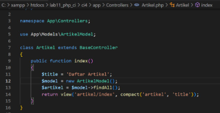

# Lab12web
utnuk memenuhi tugas pemoggramman web

Nama     : Antini permatasari<br>
NIM      : 312010095<br>
kelas    : TI.20.B.1<br>

# Praktikum 12
# Lanjutan Framework(CRUD)

Selanjutnya kita Untuk memulai membuat aplikasi CRUD sederhana,<br>
yang perlu disiapkan adalah database server menggunakan MySQL.<br>
Pastikan MySQL Server sudah dapat dijalankan
melalui XAMPP.<br>

# 1.Membuat Database 

CREATE DATABASE lab_ci4;

Kemudian kita buatlah tabel seperti berikut ini.<br>


# 2.Konfigurasi koneksi database

Lalu kita membuat konfigurasi untuk menghubungkan dengan database server.<br>
Konfigurasi dapat dilakukan dengan du acara, yaitu pada file app/config/database.php
atau menggunakan file.<br>


# 3.Membuat Model

Lalu kita membuat Model untuk memproses data Artikel. Buat file baru pada
direktori dengan nama ArtikelModel.php<br>


# 4.Membuat Controller

Selanjutnya kita Buat Controller baru dengan nama Artikel.php pada direktori app/Controllers<br>
sebagai berikut:<br>



# 5.Membuat View

Kemduian kita akan Buat direktori baru dengan nama artikel pada direktori app/views,<br>
lalu buat file baru dengan nama index.php.<br>


Lanjut kita buka browser, dengan mengakses url http://localhost/lab11_php_ci/ci4/public/artikel


Kemudian Belum ada data yang diampilkan,Lalu kita coba tambahkan beberapa data pada
database agar dapat ditampilkan datanya sebagai berikut.<br>


Lanjut kita Refresh browser, dan maka hasilnya akan seperti berikut ini :<br>


# 6.Membuat Tampilan Detail Artikel

Kemudian kita Tampilan pada saat judul berita di klik maka akan diarahkan ke halaman yang berbeda.<br>
dan Tambahkan fungsi baru pada Controller Artikel dengan nama view().<br>


# 7.Membuat View Detail

Lalu kita akan Buat view baru untuk halaman detail dengan nama app/views/artikel/detail.php<br>


# 8.Membuat Routing untuk artikel detail

Lanjut kita akan Buka Kembali file app/config/Routes.php, kemudian tambahkan routing untuk artikel
detail sebagai berikut.<br>


# 9.Membuat Menu Admin

Kemudian kita akan Menu admin adalah untuk proses CRUD data artikel.<br>
lalu kita Buat method baru pada Controller Artikel dengan nama admin_index().<br>


Selanjutnya kita akan buat view untuk tampilan admin dengan nama admin_index.php<br>

```
<?= $this->include('template/admin_header'); ?>

<table class="table">
    <thead>
        <tr>
            <th>ID</th>
            <th>Judul</th>
            <th>Status</th>
            <th>AKsi</th>
        </tr>
    </thead>
    <tbody>
        <?php if ($artikel) : foreach ($artikel as $row) : ?>
                <tr>
                    <td><?= $row['id']; ?></td>
                    <td>
                        <b><?= $row['judul']; ?></b>
                        <p><small><?= substr($row['isi'], 0, 50); ?></small></p>
                    </td>
                    <td><?= $row['status']; ?></td>
                    <td>
                        <a class="btn" href="<?= base_url('/admin/artikel/edit/' . $row['id']); ?>">Ubah</a>
                        <a class="btn btn-danger" onclick="return confirm('Yakin menghapus data?');" href="<?= base_url('/admin/artikel/delete/' . $row['id']); ?>">Hapus</a>
                    </td>
                </tr>
            <?php endforeach;
        else : ?>
            <tr>
                <td colspan="4">Belum ada data.</td>
            </tr>
        <?php endif; ?>
    </tbody>
    <tfoot>
        <tr>
            <th>ID</th>
            <th>Judul</th>
            <th>Status</th>
            <th>AKsi</th>
        </tr>
    </tfoot>
</table>

<?= $this->include('template/admin_footer'); ?>
```

Lalu kita Tambahkan routing untuk menu admin seperti berikut:<br>


Lalu Setelah itu saya buat template header dan footer baru untuk Halaman Admin di direktori app/view/template.<br>


Kemudian saya tambahkan file css pada direktori ci4/public untuk mempercantik tampilan Halaman Admin.<br>
Dan hasilnya seperti berikut ini:<br>


# 10.Menambah Data Artikel

Selanjutnya kita akanTambahkan fungsi/method baru pada Controller Artikel dengan nama add().<br>


Lalu Kemudian kita buat view untuk form tambah dengan nama form_add.php<br>


Dan kita Tambahkan fungsi/method baru pada Controller Artikel dengan nama edit().<br>


Lalu Kemudian kita buat view untuk form tambah dengan nama form_edit.php<br>


# 11.Menghapus Data

Selanjutnya kita akan Tambahkan fungsi/method baru pada Controller Artikel dengan nama delete().<br>

